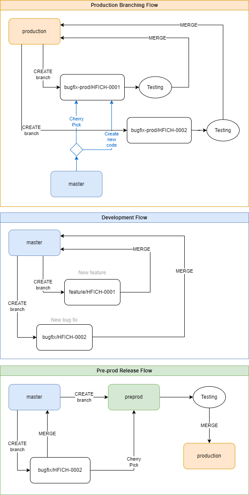

# Versioning & GIT branching

## Procesy - JIRA, zadávání práce na vývoj, atd.

### Vývoj nových features
- každá US je označena FV ve které se má dodat
- vše co je v aktuálním sprintu je možné mergovat do `master` branch, pokud nebude při předávce explicitně řečeno jinak
- pokud není co dělat, je možné si vzít tasky z dalšího následujícího sprintu  
-> tasky, které jsou připravené na vývoj (v dalším sprintu) mají tag **ReadyForDevelopment** a jsou přiřazené na konkrétního vývojáře / team leada  
-> každý task, který se bere z jiného než aktuálního sprintu je nutné konzultovat s ITA, zda je možné ho mergovat rovnou do `master` nebo zda se jedná o změnu, která nesmí být součástí verze aktuálního sprintu  
-> tasku vzatému z budoucího sprintu je změněna FV (??? na co a kdo to udělá) a je zařazen do aktuálního sprintu (??? co když je součástí US, která má více tasků, ale jen jeden z nich chceme dělat nyní)
- chyby nalezené na `release` branch automaticky fixujeme i do `master` branch (??? jak vůbec poznáme, že bug je z `release` branch)

### Opravy chyb
- fix nalezeného bugu automaticky propisujeme do všech nižších prostředí, tj.:  
-> bug na `production` je automaticky fixován i do `master` a `release`  
-> bug na `release` je automaticky fixován i do `master`  
-> bug na `master` je fixován pouze na `master`

??? jak poznáme ze zadaného bugu o jaké prostředí se jedná?

## GIT branching

### Production flow
Existuje pouze jeden branch s produkční verzí aplikace - `production`.

V této větvy vznikají *tagy*, které označují jednotlivé **Fix Version** (FV) aplikace. Je tedy možné se kdykoliv vrátit / nasadit ke konkrétní Fix Version.
Ve chvíli nasazení nové verze aplikace (tj. merge `release` do `production`) se poslední mergnutý commit označí tagem FV, tím tedy fakticky vzniká historie nasazovaných změn.

**Hotfix bugu:**
1) vytvoření bugfix branch z `production` branch - `bugfix-prod/HFICH-XXXX`. Název nové branch musí vždy obsahovat ID bugu.
2) oprava chyby
3) otestování aplikace nasazením branch `bugfix-prod/HFICH-XXXX` na testovací prostředí
4) merge branch `bugfix-prod/HFICH-XXXX` do `production`
5) nasazení na server z branch `production`

Chyba na produkci se automaticky musí opravit i na `master` a `release`.  
Je na zvážení programátora zda udělat cherry pick `bugfix-prod/HFICH-XXXX` do `master` nebo daný bug opravit v `master` samostatně.
Pokud se opravované místo na `master` a `production` zásadně liší, je na zvážení programátora zda dokáže opravu na master udělat nebo je potřeba konzultovat s ITA.

### Development flow
Existuje pouze jeden branch do kterého se vyvíjí - `master`.

Ve chvíli, kdy je kód připraven na release do produkce, vytvoří se z master nový branch - `release`.
`release` branch se testuje na vlastním prostředí.
Pokud budou nalezeny chyby, opravují se jak do `release`, tak do `master` branch.
Pokud by se stalo, že oprava chyby není triviální nebo bude potřeba dodělat novou funkčnost, je na zvážení, zda aktuální `release` nezahodit a vytvořit nový `release` z aktuální verze `master` kde již daná funkčnost/bug bude opravený.

**Vývoj nového JIRA tasku:**
1) vytvoření feature branch z `master` - `feature/HFICH-XXXX`. Název nové branch vždy obsahuje ID US nebo Subtasku.
2) vývoj v nově vytvořené branch
3) merge `feature/HFICH-XXXX` do `master`

**Bugfix na `release`**
1) oprava chyby na `master` branch formou commitu - v commit message bude ID bugu
2) cherry pick daného commitu do `release`

**Nasazení `release` do produkce**
1) merge `release` branch do `production` branch
2) vyřešení případných merge conflicts
3) nasazení nové verze `production` na testovací prostředí
4) nasazení otestovaného buildu na produkci



## Verzování endpointů FE API (NOBY.Api)
Na FE API používáme verzování jednotlivých endpointů místo verze celého API. 
To znamená, že jednotlivé endpointy mohou mít v jednu chvíli každý jinou verzi, nicméně spolu budou fungovat.
Novou verzi vytváříme pouze v případě, že se mění byznys logika za endpointem nebo se mění kontrakt takovým způsobem, že FE danou změnu nedokáže zpracovat.

> Snažíme se pokud možno vytvářet co nejméně nových verzí endpointů.

Tento způsob verzování jsme zvolili protože:
a) potřebujeme umožnit nezávislý vývoj BE a FE
b) z praktických důvodu nelze s každou změnou vytvářet novou verzi celého API

Staré verze endpointů nemažeme dokud nebude nasazena kompaktibilní verze FE na produkci a nebude možnost smazání potvrzena ITA. 
Do té doby jsou staré verze endpointů odekorovány atributem `[Obsolete]`.

Ukázka side-by-side verzí endpointů:
```
v1/GetCase
...
v2/GetCustomer              [Obsolete]
v3/GetCustomer              [Obsolete]
v4/GetCustomer
(v1 already deleted)
...
v1/UpdateCustomer           [Obsolete]
v2/UpdateCustomer
```

### Technické zpracování verzování na FE API
Infrastruktura verzování je zajištěna knihovnou [Microsoft.AspNetCore.Mvc.Versioning](https://github.com/dotnet/aspnet-api-versioning).
Požadovaná verze konkrétního endpointu je při requestu specifikovaná v HTTP headeru **X-Api-Version**.

### Nastavení verzí v controllerech
```csharp
[ApiController]
public class WeatherController
{
    [ApiVersion("v1", Deprecated = true)]
    public async Task Get() { ... }

    [ApiVersion("v2")]
    public async Task GetV2() { ... }
}
```

### Přidání nové verze do projektu
TODO

## Verzování endpointů doménových služeb
U doménových služeb se s každou změnou i jediného endpointu vytváří nová verze celého API.
Tj. pokud změním kontrakt endpointu GetDetail a vytvořím *v2*, tak automaticky vystavujeme všechny ostatní endpointy v nové verzi (*v2*).
Technicky to znamená pouze provolání stejných *Mediatr* handlerů, takže overhead s vytvořením nové verze celého API není tak velký.

### Vytvoření nové verze API
Vytvoření nové verze API znamená vytvoření nové verze gRPC služby.

**Api project**

1) přidání nové controlleru nové služby
```
DomainServices.CaseService.Api      (project)
  Endpoints                         (endpoints folder)
    CaseServiceV1.cs                (old service version)
    CaseServiceV2.cs                (new service version)
```

2) registrace endpointů v `Program.cs`
```csharp
SharedComponents.GrpcServiceBuilder
...
.MapGrpcServices(app =>
{
    app.MapGrpcService<DomainServices.CaseService.Api.Endpoints.CaseServiceV1>();
    app.MapGrpcService<DomainServices.CaseService.Api.Endpoints.CaseServiceV2>();
})
...
```

**Clients project**

TODO

**Contracts project**
```
Messages
  V2
    GetCaseV2.proto         (V2 specific request and response contracts)
    ...
  GetCase.proto             (default - V1 - request and response contracts)
  ...
CaseService.v1.proto        (V1 service descriptor)
CaseService.v2.proto        (V2 service descriptor)
```

## Adresářová struktura multi version endpointů
V NOBY.API i v doménových službách jsou jednotlivé verze vytvořené jako podadresáře vždy v hlavním adresáři daného endpointu.
Zároveň v hlavním adresáři endpointu mohou být umístěné sdílené komponenty daného endpointu (pokud nějaké jsou).

```
Endpoints                               (all endpoints folder)
  Customer				(tag folder - endpoints group)
    GetCustomer			        (feature folder for multi-version endpoint)
      GetCustomerRequest.cs	        (shared request contract)
      V1                                (version folder)
        GetCustomerHandler.cs
        GetCustomerResponse.cs
      V2                                (version folder)
        GetCustomerHandler.cs
        GetCustomerResponse.cs
    ...
    UpdateCustomer                      (feature folder for single version endpoint)
      UpdateCustomerHandler.cs
      UpdateCustomerRequest.cs
```
